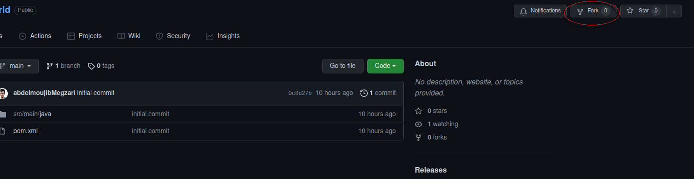
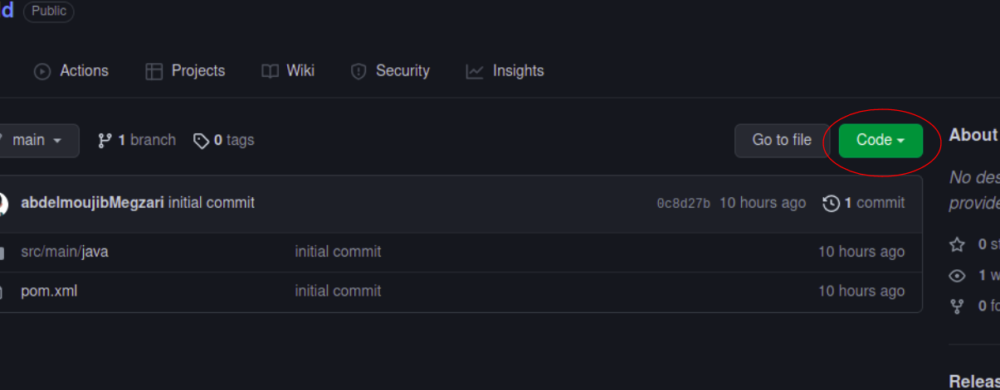

# Cloning the work repository

The first step to for this tutorial is to create a git repository that CI pipeline build and run static code scanning against.
Lucky for you we have already created a git repository which you can fork and use in this tutorial.  
The repository is a maven project that contain one single java main class that prints "hello world!" on the screen.

Let's start by forking the new repository:  
https://github.com/abdelmoujibMegzari/hello_world

For those of you unfamiliar with GitHub, open this link after you connect to your GitHub account.  
on the top right of the screen you should see a fork button click on it.

A new repository will be created on your account that is an exact copy of this one. It should be open automaticaly after you have clicked on fork.

Next clone the repository into your local machine.  
For this tutorial we suggest that you use the Katacodas terminal.
execute `git clone <repo>`

You can get the repository link by clicking the green button on github on your repository.

Next go to the newly clowned repository.
`cd hello_world`{{execute}}
