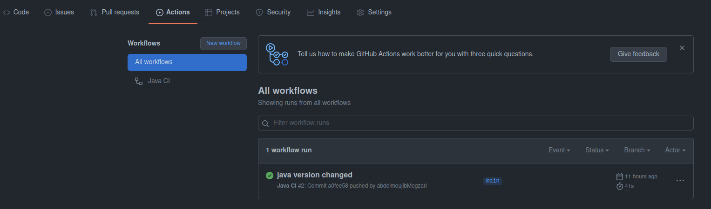

# Checking that the build ran correctly
To check if the project builds correctly open your GitHub repository.  

Go to actions tab.  

There your new commit should be marked in green.  

If the color is yellow it's still building give it some time.