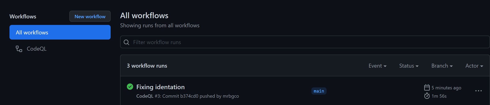
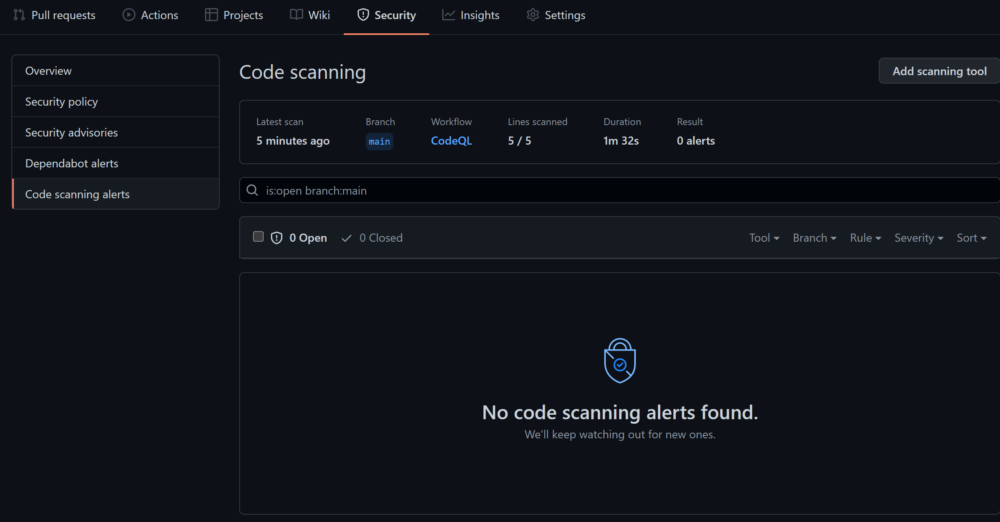

# Go and check result on the pipeline

Go to actions tab.  

There your new commit should be marked in green.  

If the color is yellow it's still building give it some time.

Now go to Security tab, and see if we got anything dangerous in the code.
