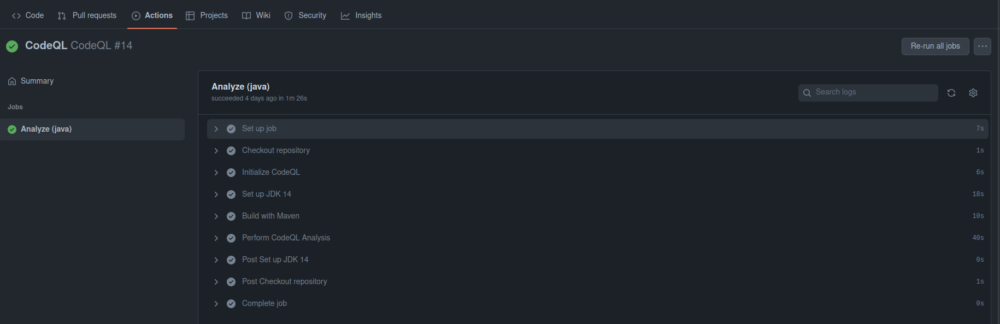
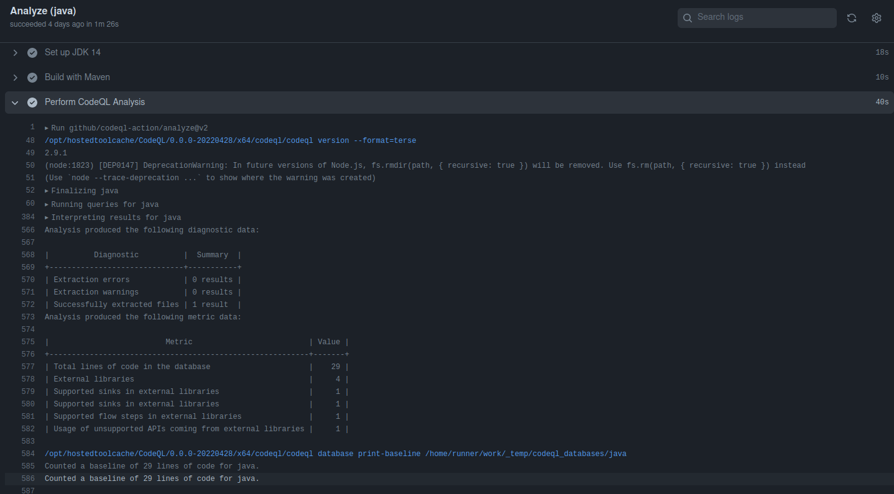
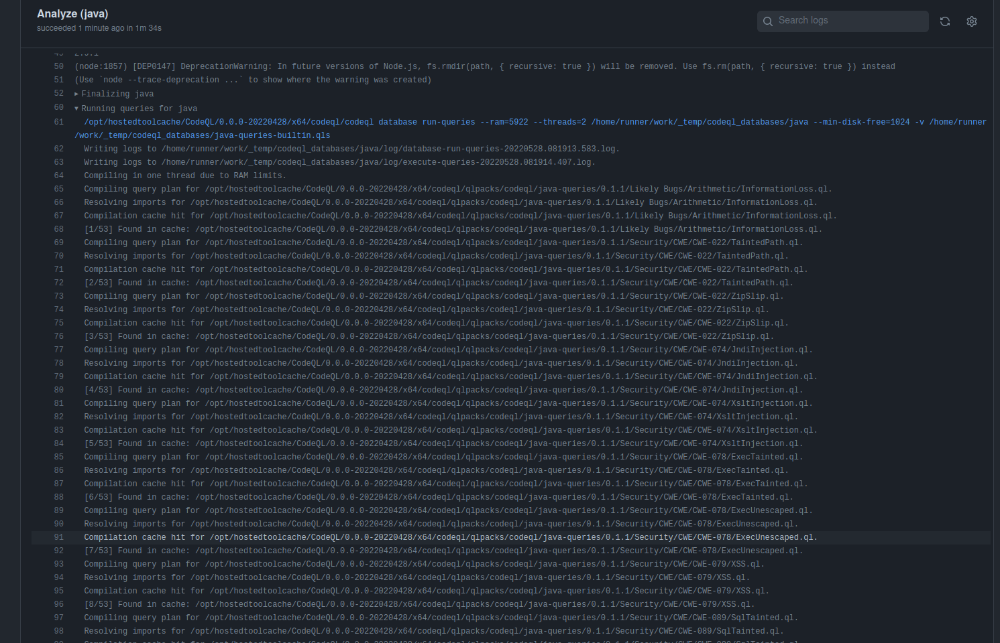
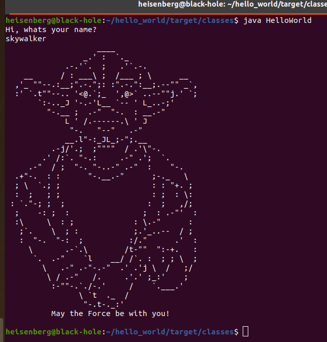

# Go and check result on the pipeline

Go to actions tab.  

There your new commit should be marked in green.  

If the color is yellow it's still building give it some time.

Now go to Security tab, and see if we got anything dangerous in the code.

Nice!
Looks pretty clean..

Now let's take a look at the different steps in our pipeline

If we look at the perform codeQL analysis step, we can notice more information concerning the analysis.

Finally, if we check the running queries for java, we can see all the vulnerabilities that codeQL has checked for.

Now we are reaching the end of the tutorial.
Master Yoda should have said it by now, but we want to say it again. May the force be with you!

This is the hidden easter egg. You can see it by typing the name of some Jedis like "yoda" or "skywalker" when running the hello world program
credits to Blazej Kozlowski & Faux_Pseudo for this piece of art
